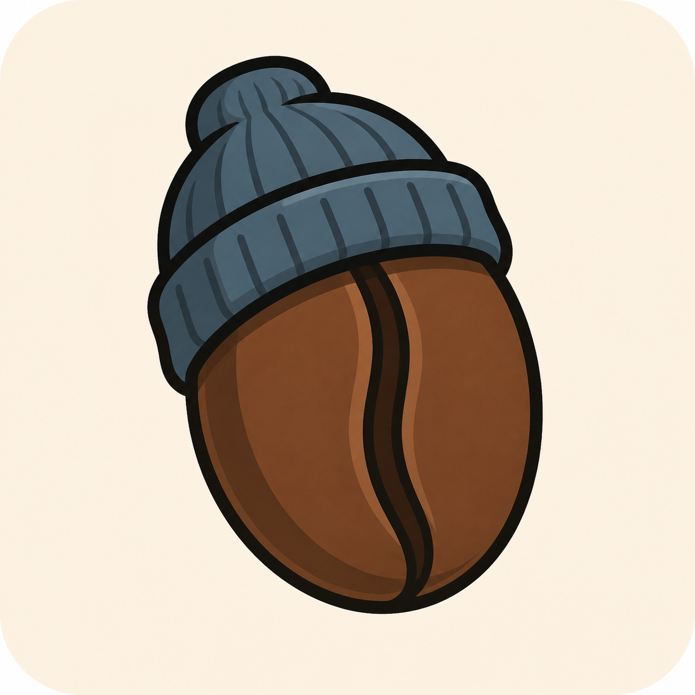

# Beanie



Beanie is a bean-first WebUI skin for Decent.app.

The core workflow:

1. Wake into the last active bean and its current workflow.
2. Pick another bean with one tap.
3. Load the last successful setup for that bean: profile, dose, yield, grinder, and grind setting.
4. Review previous shots for that bean with compact graphs.
5. Adjust, apply, clear, and save presets without leaving the workbench.

## Development

```bash
npm install
npm run skin:dev
```

`npm run skin:dev` writes a small development shim into Decent.app's Beanie skin
folder, then starts Vite on `localhost:5173`. Decent.app still opens the skin
from `http://localhost:3000/`, but the page loads the app modules from Vite, so
source changes hot reload without rebuilding or copying `dist`.

During development, Beanie resolves Decent.app API calls from the Decent-served
page. On the local machine this means the skin uses the gateway at
`localhost:8080`. Override with:

```bash
BEANIE_GATEWAY=http://192.168.1.42:8080 npm run skin:dev
```

If no gateway is reachable, the skin falls back to realistic demo data so the UI remains inspectable.

Useful development commands:

```bash
npm run skin:shim     # only install the Decent.app -> Vite shim
npm run skin:dev      # install the shim and start Vite with hot reload
npm run skin:deploy   # build and copy the static skin into Decent.app
```

The default Decent skin folder is:

```text
~/Library/Containers/net.tadel.reaprime/Data/Documents/web-ui/beanie
```

Override it with `DECENT_SKIN_DIR=/path/to/beanie`.

## Release

```bash
npm test
npm run skin:deploy
npm run release:zip
```

`npm run skin:deploy` replaces the dev shim with the current static build in the
Decent.app skin folder.

The release zip is installable from Decent.app's Web Interface settings. The zip contents place `index.html` and `manifest.json` at the root, matching Decent.app's skin installer expectations.

## Architecture

Beanie intentionally follows Streamline's static-web model:

- No UI framework runtime.
- Direct REST and WebSocket calls to the Decent.app gateway.
- Static files served by Decent.app on port 3000.
- Local storage only for skin-owned conveniences such as bean presets and last selected bean.

See [docs/workplan.md](docs/workplan.md) for the product and engineering plan.
