# Beanie — Phone UI Audit

A deep walkthrough of every area of Beanie at phone size, documenting where the
phone experience is weak, broken, or missing. The goal is a complete inventory of
problems, not fixes.

- **Date:** 2026-06-24
- **App version:** 0.2.7 (dev build)
- **Viewport tested:** 390 × 844 (iPhone 12/13/14 class), portrait, `deviceScaleFactor: 2`
- **Phone media query in code:** `(max-width: 640px), (max-height: 500px) and (max-width: 900px)` ([app.ts:453](../../src/app.ts#L453))
- **Method:** Drove the live dev server (port 5199) with a scripted Chromium walk,
  screenshotting every reachable screen + every overlay, plus computed-style and
  reachability probes. Screenshots are in [`screenshots/`](screenshots/).

> **Severity legend** — 🔴 Critical (broken / unusable / unreachable) ·
> 🟠 Major (significantly degrades the task) · 🟡 Minor (polish / friction).

---

## TL;DR — the core problem

Beanie's phone build is a **companion shell bolted onto a tablet app**, not a phone
app. The bottom-tab shell (Home / Scan / Beans / Shots / Settings) is genuinely
phone-native and mostly good. But:

1. **Only 2 of ~10 views are phone-aware.** The phone shell renders only for the
   `workbench` and `settings` views ([app.ts:6636](../../src/app.ts#L6636)).
   *Everything else* — Machine, full History, Profiles editor, Grinder editor,
   Flow calibrator, the cleaning wizard, the bean picker, the add/edit-bean form,
   the label scanner, the shot editor — renders the **tablet layout squeezed into
   a phone**, or is **not reachable at all**.
2. **Whole feature areas are unreachable on a phone.** There is no navigation path
   to the Machine page, full History, the Cleaning wizard, Water settings, or the
   Flow calibrator. The tablet top-bar that links to them is never rendered, and no
   equivalent buttons exist in the phone shell.
3. **No live shot on a phone.** The live telemetry / shot graph panel is explicitly
   omitted in phone mode ([app.ts:6641](../../src/app.ts#L6641)). During an actual
   extraction the phone shows nothing live.

The nav's own accessibility label — `"Phone helper sections"`
([phoneView.ts:61](../../src/views/phoneView.ts#L61)) — captures the design intent:
the phone is treated as a *helper*, not a controller. That intent is exactly what
makes it feel "very lacking."

---

## Part A — Architecture-level weaknesses (cross-cutting)

### A1. 🔴 Most of the app falls through to tablet layouts
`render()` only switches to the phone shell for `workbench`/`settings`
([app.ts:6635-6640](../../src/app.ts#L6635)). Any other `view` is rendered by
`renderPage()` ([app.ts:6798](../../src/app.ts#L6798)) or `renderModal()`, both of
which were built for an 8" landscape tablet. The result: the bean picker, add-bean
form, label scanner, profile list, profile editor, grinder editor, and flow
calibrator all inherit tablet grid/split-pane assumptions on a 390px screen.

### A2. 🔴 Entire areas have no phone entry point
Probing every rendered `data-action` on every phone screen, these navigation
targets **do not exist anywhere in the phone UI**:

| Area | Tablet view | Reachable on phone? |
|------|-------------|---------------------|
| Machine controls / status page | `machine` | ❌ no button |
| Full shot History page | `history` | ❌ (only Home's last 3 + the Shots tab list) |
| Cleaning wizard | `cleaning` | ❌ no button |
| Water settings | `water` | ❌ no button |
| Flow calibrator | `flow-calibrator` | ❌ no button |
| Profile editor / Grinder editor | `profile-editor`, `grinder-editor` | ❌ (picker is view-only) |

The tablet reaches these through a top-bar / workbench chrome that is never
rendered in phone mode, and the phone shell offers no replacement. A phone user
literally cannot clean the machine, calibrate flow, change water settings, or open
the machine page.

### A3. 🔴 No live shot / telemetry on phone
`renderLivePanel()` is skipped when `renderPhone` is true
([app.ts:6641](../../src/app.ts#L6641)). So while a shot is pulling, the phone has
no live pressure/flow/weight graph and no live readouts. The richest, most
real-time part of the product is absent on the device most likely to be in your
hand at the machine.

### A4. 🟠 Recipe edits auto-apply silently with no phone-visible feedback
Editing Dose/Yield/Ratio/Grind/Temp on Home calls `scheduleApply()`
([app.ts:6117](../../src/app.ts#L6117)), which debounce-pushes the draft to the
machine. The only feedback is `status: 'Draft changed'`
([app.ts:6116](../../src/app.ts#L6116)) — and the phone shell never renders the
status string. So a change to the machine happens with **zero on-screen
confirmation**. There's also no explicit "apply" affordance, so it's unclear edits
do anything.

### A5. 🟠 Tablet modals reused instead of phone sheets
Bean picker, add/edit-bean, label scanner, and shot editor all render through the
shared `.modal-backdrop` path. At phone width they're widened to near-edge
(`width: min(100vw - 16px, 560px)`, [styles.css:9254](../../src/styles.css#L9254)),
but they keep tablet *internal* layouts (split panes, two-column field grids,
centered floating cards). None use a real phone bottom-sheet pattern, and several
leave large dead space (see B2, B4, B5).

---

## Part B — Screen-by-screen findings

### B1. Home tab — mostly good, a few traps
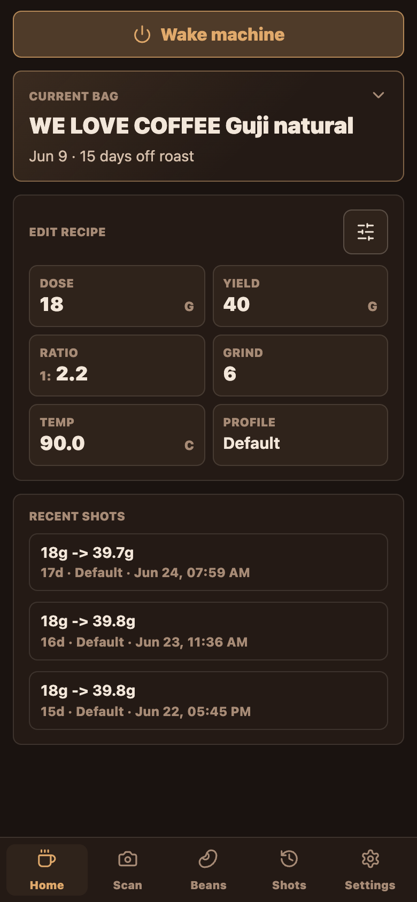

**Good:** Clean hierarchy, big Wake button (44px), current-bag hero, recipe grid,
recent shots. This is the strongest phone screen.

- 🟠 **The recipe values look read-only but are editable.** Dose/Yield/Ratio/Grind/
  Temp are borderless `<input>`s sitting inside stat-tile cells
  ([phoneView.ts:153-165](../../src/views/phoneView.ts#L153)). Computed: the input
  is ~20px tall with no border/underline/caret affordance; it reads as a *display
  stat*, not a field. Most users won't realize they can tap to edit.
- 🟡 **"~0 shots" is a confusing fact.** With a near-empty bag the hero shows
  `16g left · ~0 shots` ([phoneView.ts:104-110](../../src/views/phoneView.ts#L104));
  "~0 shots" reads like an error.
- 🟡 **No status / connection feedback.** The home shows machine state only via the
  Wake/Sleep button label; there's no surfacing of "applying", errors, or scale
  state (those live in the unreachable Connection/Machine areas).

### B2. Scan tab — ~75% dead space
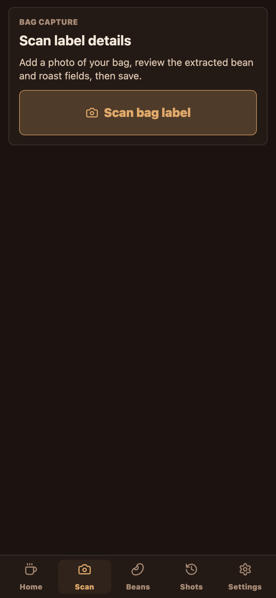

- 🟠 **One small card floats at the top with the entire lower screen empty**
  ([phoneView.ts:179-192](../../src/views/phoneView.ts#L179)). It's a whole tab for
  a single button. Either it should be a prominent full-bleed CTA, or folded into
  Home/Beans rather than occupying a primary tab.

### B3. Label scanner — centered tablet modal, isolated actions
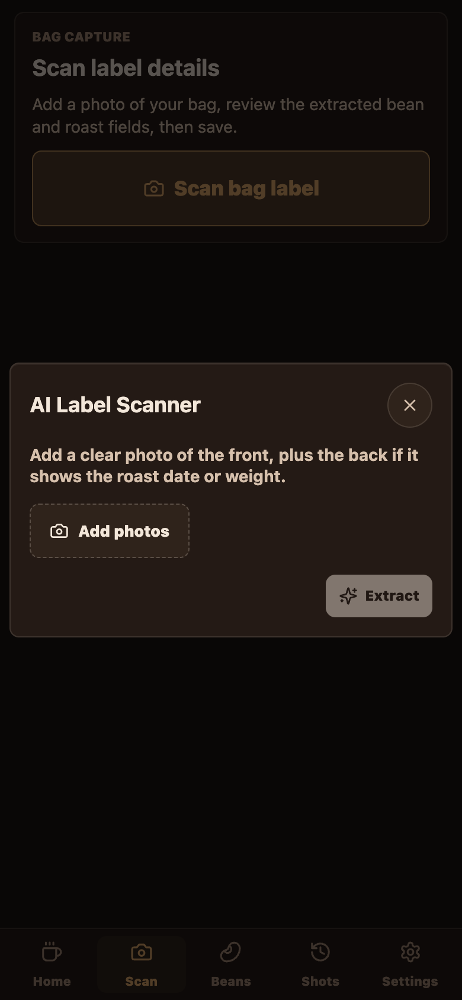

- 🟠 **Floating centered card, not a sheet.** The modal sits mid-screen over a
  dimmed Scan card, with dead space above and below.
- 🟡 **Action layout is awkward on phone:** "Add photos" is a left dashed button
  while the primary **Extract** is isolated at the bottom-right of the card; they're
  far apart and Extract is disabled-looking until photos exist.

### B4. Beans tab — the best-adapted secondary screen
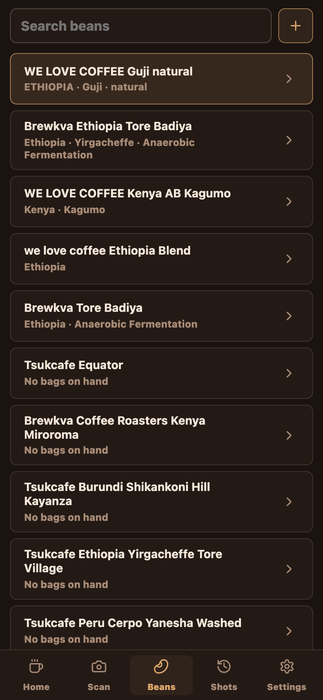

**Good:** Real phone list — search field, `+`, full-width tappable rows with name +
origin metadata, chevrons, current-bean highlight.

- 🟡 **Ambiguous tap behavior.** Tapping a row body **selects the bean as current**
  (`phone-select-bean`) while the chevron **opens the picker** (`open-edit-bean`)
  ([phoneView.ts:215-223](../../src/views/phoneView.ts#L215)). Two very different
  outcomes from one row with no visual cue distinguishing the zones.
- 🟡 The `+` add button is a small 42px square next to a full-width search — minor
  target imbalance.

### B5. Bean picker ("Choose coffee" / edit bean) — tablet split-pane crammed

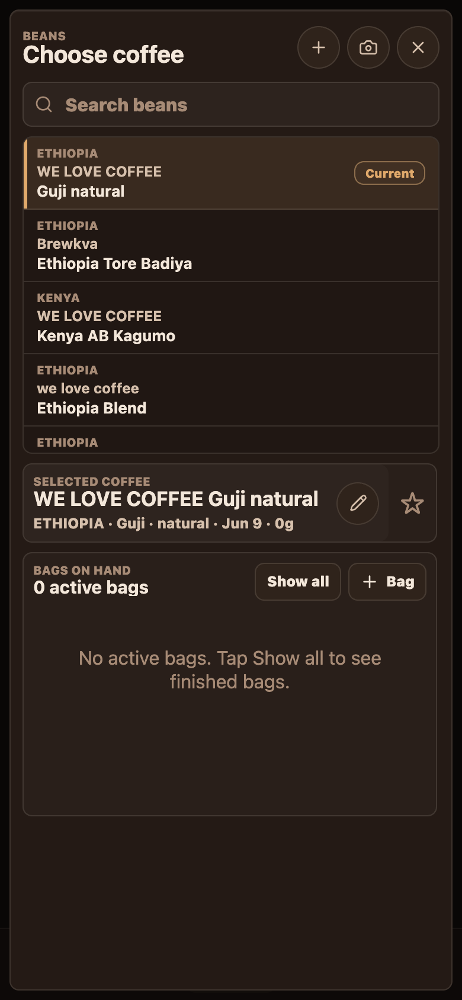

This modal opens from Home's hero, the picker's own flows, **and** the Beans-tab
chevron ("edit bean" reuses the exact same modal — there is no focused edit screen).

- 🔴 **Two-pane tablet layout stacked into fixed rows.** `.bean-picker-body` becomes
  `grid-template-rows: minmax(150px, 0.42fr) minmax(0, 0.58fr)` at ≤860px
  ([styles.css:3152](../../src/styles.css#L3152)). On a tall phone the bean **list is
  pinned to ~42% and scrolls internally** (only ~4 beans visible) while the inspector
  pane gets 58% — and when the inspector is short, **the bottom half is dead space**
  (clearly visible in the edit-bean capture). A phone wants one column that flows and
  scrolls as a whole, with the list using available height.
- 🟠 **"SELECTED COFFEE" title truncates** ("WE LOVE COFFEE Guji nat…") even though
  there's horizontal room, because it shares a row with the edit/favorite buttons.
- 🟡 Three icon-only header buttons (`+`, camera, `×`) at ~36px are on the small side.

### B6. Add coffee form — duplicated title, top-anchored cancel, long scroll
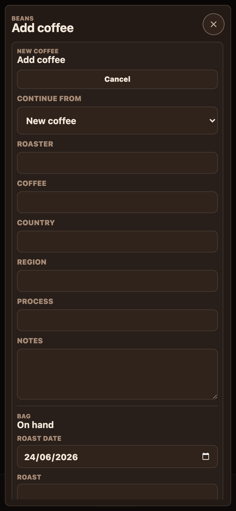

- 🟠 **Title appears twice:** header "BEANS / Add coffee" *and* a section "NEW COFFEE
  / Add coffee" immediately below.
- 🟠 **Cancel is at the top of the form**, directly under the duplicate title, in
  addition to the header `×`. Two cancels up top, and the primary **Save/Add is far
  below the fold** after a long single-column field stack (Roaster, Coffee, Country,
  Region, Process, Notes, then bag fields…).
- 🟡 Floating rounded card with margins rather than a full-screen form; on a phone a
  data-entry form this long should own the whole viewport.

### B7. Profile picker — name-only list, no search, no detail
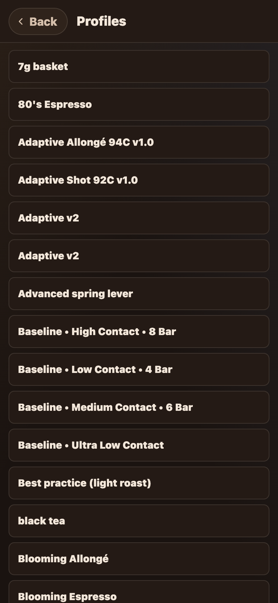

This *is* a dedicated phone page (`renderPhoneProfilePickerPage`), but it's threadbare:

- 🔴 **No search/filter.** The tablet profile picker has search; the phone page does
  not. Decent ships **dozens** of profiles (the list is a long alphabetical scroll:
  "7g basket", "80's Espresso", "Adaptive…", "Baseline…", "Blooming…"). Finding one
  means scrolling the entire list.
- 🟠 **Rows show only the title** — no temperature, dose/ratio, type, author, or the
  pressure/flow **preview chart** the tablet shows. You pick blind.
- 🟡 No grouping, no favorites, no "recently used."

### B8. Shots tab — a wall of near-identical rows
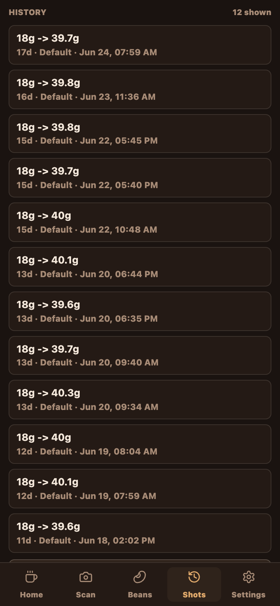

- 🟠 **No filter / search / grouping.** Every row is `dose → yield · age · profile ·
  date` ([phoneView.ts:276-288](../../src/views/phoneView.ts#L276)); with one profile
  ("Default") and a consistent recipe they're visually indistinguishable. No filter
  by bean/profile/rating, no date grouping.
- 🟡 **Ratings barely surface.** The enjoyment badge only appears on rated shots, so
  the list is mostly unannotated and hard to scan for "the good ones."
- 🟡 Header ("HISTORY / N shown") sits flush at the very top with minimal inset.

### B9. Shot detail (expanded inline) — unreadable chart + very tall
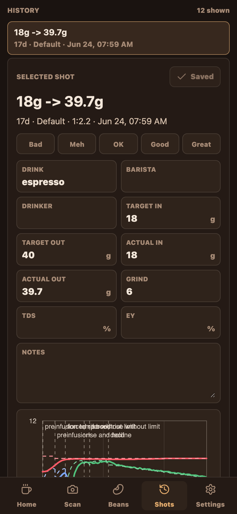

- 🔴 **The shot graph's annotation labels overlap into illegible mush.** The
  preinfusion/temp/limit labels collide on top of each other at phone width (see
  capture). The chart is reused from a wider layout and its label placement doesn't
  reflow.
- 🟠 **The detail is enormous.** Selecting a shot expands an inline card with a score
  row, an 11-field two-column grid, a notes textarea, and the chart — pushing the
  rest of the list far down. There's no collapse affordance near the bottom.
- 🟡 The chart canvas is short and cramped under all the fields.

### B10. Settings — half the settings are missing; lots of empty space
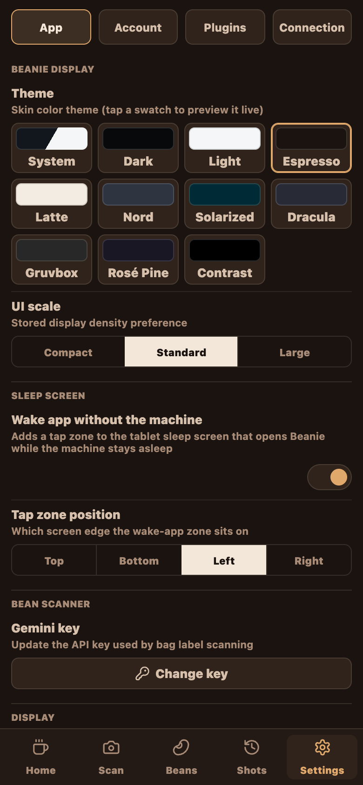
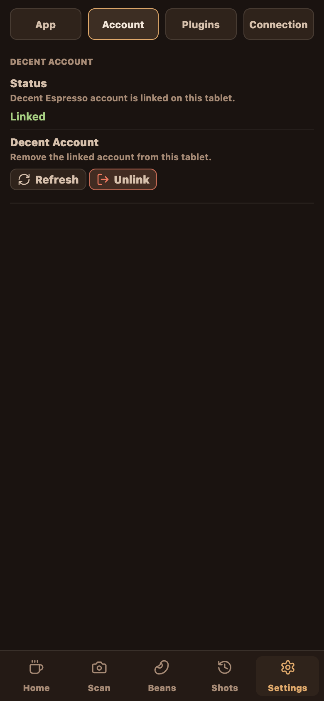

The phone passes a restricted section list to the settings shell:
`['app', 'account', 'plugins', 'connection']`
([app.ts:6677](../../src/app.ts#L6677)).

- 🔴 **No Machine settings on phone.** The tablet's machine/water/cleaning settings
  are not in the phone section set, reinforcing A2 — no way to reach machine config.
- 🟡 **Short sections waste most of the screen.** Account and Plugins fill ~30% then
  leave a large void; the 4-button section switcher sits flush at the top.
- 🟢 **Connection** and **App** sections themselves reflow fine and are content-rich.

---

## Part C — Quantitative / theme notes

- **Touch targets:** phone-tab buttons 48px (good); Wake 44px (good); recipe
  `<input>` ~20px tall inside a ~38–58px cell (the *cell* is the target, but the
  field gives no edit affordance); bean-picker header icons ~36px (borderline).
- **Type:** bottom-tab labels are **10.5px** — small for a primary nav.
- **Safe areas:** the phone *shell* handles insets
  (`.phone-main` top, [styles.css:8648](../../src/styles.css#L8648); `.phone-tabs`
  bottom, [styles.css:9202](../../src/styles.css#L9202)). But page views (profile
  picker) and modals render outside `.phone-main`, so they don't inherit the top
  inset and sit flush under a notch/status bar.
- **Dead space** is a recurring theme (Scan tab, bean-picker lower pane, short
  Settings sections, label-scanner modal) — a direct symptom of tablet layouts that
  size to a fixed split rather than flowing.
- **Console:** one `404 (Not Found)` during load (non-fatal); no JS errors thrown
  during the walk.

---

## Part D — Priority shortlist (from Pass 1)

| # | Severity | Finding |
|---|----------|---------|
| 1 | 🔴 | Machine / History / Cleaning / Water / Flow-calibrator have **no phone entry point** (A2) |
| 2 | 🔴 | **No live shot view** on phone (A3) |
| 3 | 🔴 | Bean picker is a tablet split-pane: cramped list + dead lower half (B5) |
| 4 | 🔴 | Profile picker has **no search** and **no detail** (B7) |
| 5 | 🔴 | Shot-detail **chart labels overlap / unreadable** (B9) |
| 6 | 🟠 | Recipe fields look read-only; apply happens silently (B1, A4) |
| 7 | 🟠 | Add-coffee form: duplicate title, top-anchored cancels, save below fold (B6) |
| 8 | 🟠 | Shots list: no filter/search/grouping, ratings hidden (B8) |
| 9 | 🟠 | Scan tab is 75% empty; label scanner is a floating tablet modal (B2, B3) |
| 10 | 🟡 | Ambiguous Beans-row tap zones; small nav labels; modal safe-area insets (B4, C) |

---

---

## Part E — Pass 2 (deeper sweep)

Second pass focused on interactions, orientation, themes, density, and empty/edge
states — things a single screenshot per screen misses.

### E1. 🟠 Landscape = a stretched portrait, not a landscape layout
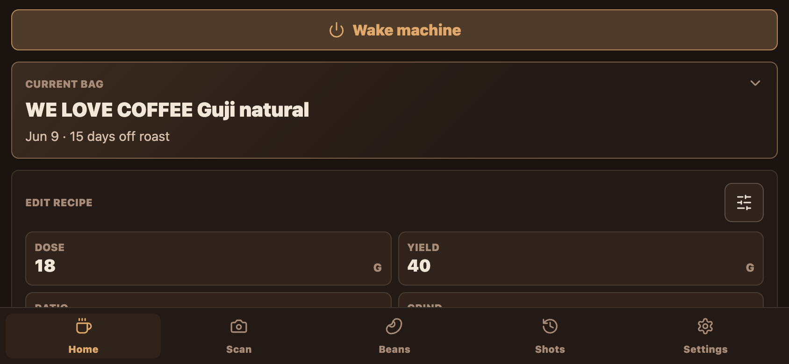

The phone media query also matches landscape phones (`(max-height: 500px) and
(max-width: 900px)`), so the phone shell *does* engage when you rotate. But the
layout is the **identical single column stretched to full width**: the Wake button
and Current-bag hero span the full ~844px for a few words of content, while
vertically only ~1.5 cards fit above the bottom tab bar (which eats ~70px of 390px).
Everything useful is below the fold. A landscape phone should use 2–3 columns or a
compact layout; instead it wastes the width and starves the height.

### E2. 🔴 The bean picker is nearly unusable in landscape
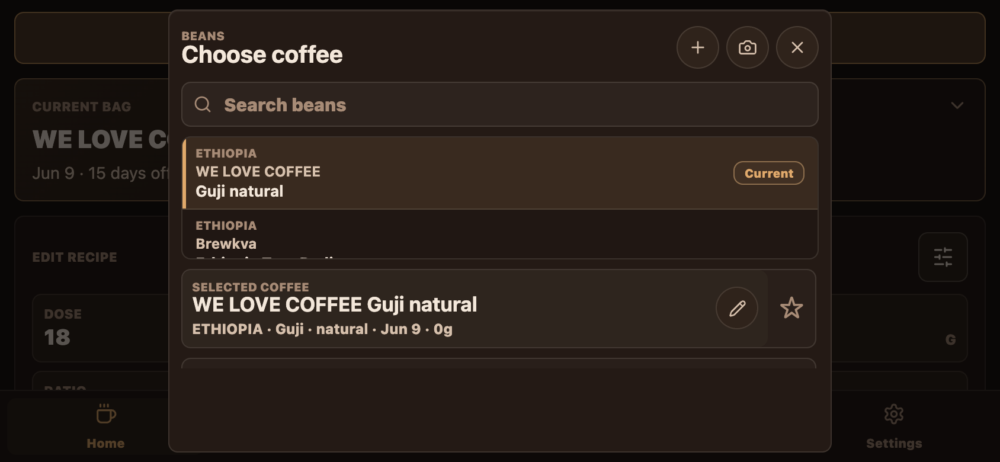

The same fixed `0.42fr / 0.58fr` split (B5) combined with the reduced landscape
height means the bean **list shows barely one-and-a-half beans** before its internal
scrollbar, and the bags list is clipped. The split-pane that's awkward in portrait
becomes broken in landscape.

Even in portrait with "Show all" expanded, the modal keeps **two independent scroll
regions** (bean list + bags list) inside one phone modal, with dead space still
below — a textbook tablet split-pane forced onto a phone:
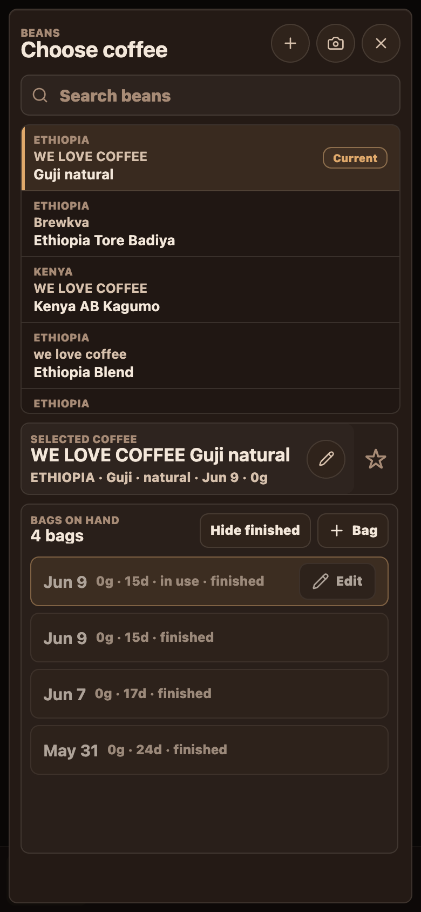

### E3. 🟠 Inconsistent numeric entry — the good keypad isn't used where it matters
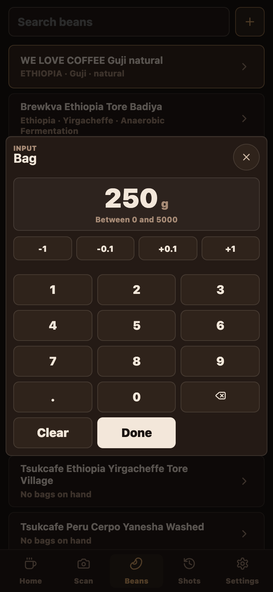

Bag/weight fields open a genuinely nice **custom numeric keypad** (big 1–9 keys,
`-1 / -0.1 / +0.1 / +1` steppers, Clear/Done) via `open-number-edit` — exactly the
right control for a phone. **But the most-used numeric inputs don't use it:** Home's
Dose/Yield/Ratio/Temp ([phoneView.ts:153](../../src/views/phoneView.ts#L153)) and
the shot-detail fields ([phoneView.ts:335](../../src/views/phoneView.ts#L335)) are
bare `<input type="number">` relying on the OS keyboard. The polished control exists;
the primary screens don't reuse it.

### E4. 🔴 The shot-graph label collision is real and theme-independent
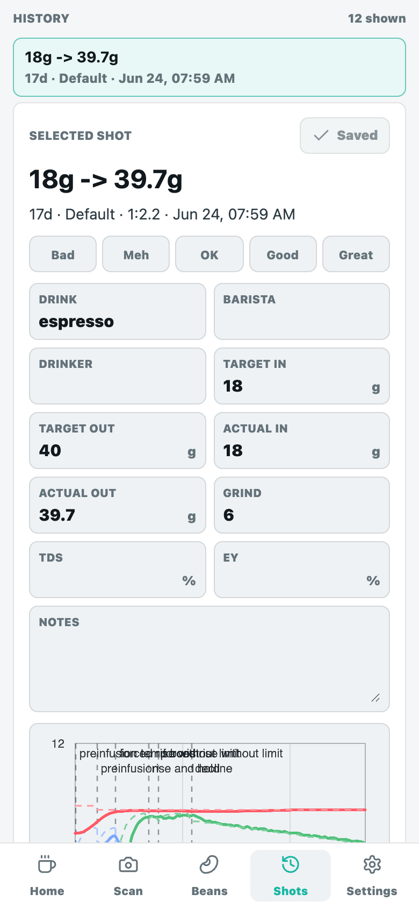

Confirmed in both dark (B9) and light themes: the chart's phase annotation labels
("preinfusion", "temp boost", "rise without limit", "rise and decline") render at
fixed x-positions and **overprint each other into illegible text** at phone width.
This is the single most visibly broken element in the phone build.

### E5. 🟡 Empty states are bare, and inputs aren't phone-tuned
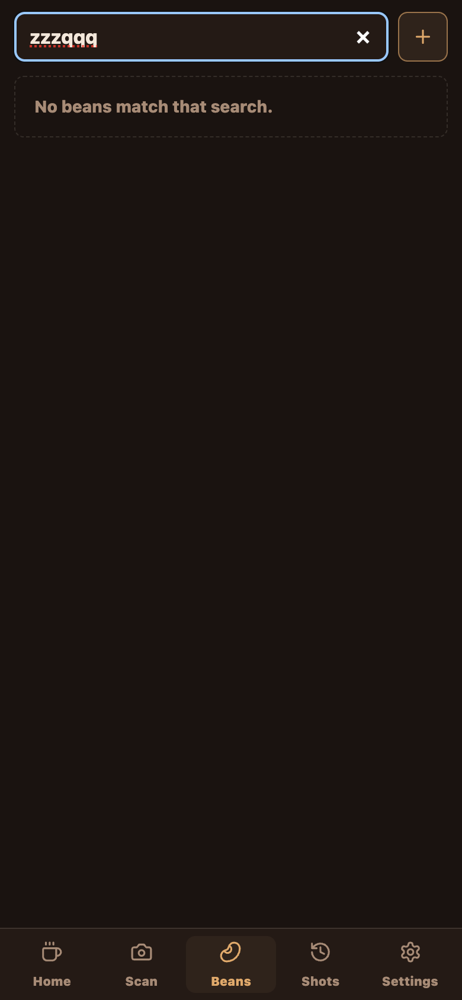

- The "No beans match that search." empty state is a thin dashed strip над a full
  screen of void — no icon, and (notably) **no "add the coffee you just searched
  for" CTA**, which is the obvious next action.
- The search field shows a **native spellcheck squiggle** on the query
  (`spellcheck`/`autocorrect` not disabled on the `type="search"` input,
  [phoneView.ts:200](../../src/views/phoneView.ts#L200)).
- Empty shot-detail fields (Barista, Drinker, TDS, EY) render as blank stat tiles
  with a lone floating unit ("%"), reinforcing the read-only-looking problem (B1).

### E6. 🟡 "Edit bean" has no dedicated phone screen
Both the Beans-tab row chevron (`open-edit-bean`) and the Home hero open the **same
"Choose coffee" picker modal** — there is no focused, phone-shaped bean/bag editor.
Editing a bag is therefore a 5-tap journey through a cramped split-pane modal.

### E7. 🟡 Possible status-label conflict on bags
In the expanded bags list a bag showed `0g · 15d · in use · finished` — "in use" and
"finished" together is contradictory. (May be partly from repeated test interactions
against the live gateway, but the label combination shouldn't be representable.)

### E8. 🟢 What holds up well
- **Light theme** renders correctly across Home, Beans, Shots, bean picker, and
  Settings — no contrast breakage found.
  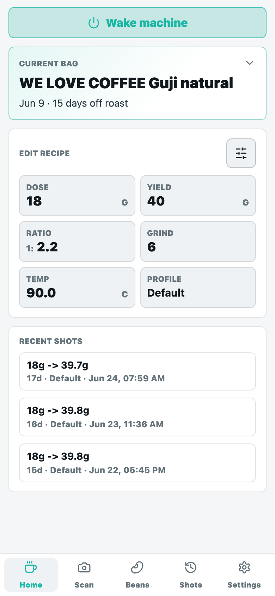
- **Narrow 320px (iPhone SE):** Home and shot detail reflow without horizontal
  overflow; the score chips tighten but still fit.
- The **bottom-tab shell**, **Beans list**, and the **custom number keypad** are all
  legitimately good phone UI — the bones are there.

---

## Updated priority shortlist (Pass 1 + Pass 2)

| # | Severity | Finding | Ref |
|---|----------|---------|-----|
| 1 | 🔴 | Machine / History / Cleaning / Water / Flow-calibrator unreachable on phone | A2 |
| 2 | 🔴 | No live shot / telemetry view on phone | A3 |
| 3 | 🔴 | Shot-graph annotation labels overprint into mush (both themes) | B9, E4 |
| 4 | 🔴 | Bean picker = fixed tablet split-pane: cramped list, dead space, ~1 bean in landscape | B5, E2 |
| 5 | 🔴 | Profile picker has no search and no profile detail/preview | B7 |
| 6 | 🟠 | Landscape is a stretched portrait (wastes width, starves height) | E1 |
| 7 | 🟠 | Recipe/shot fields look read-only; nice keypad exists but isn't used there; apply is silent | B1, A4, E3 |
| 8 | 🟠 | Add-coffee form: duplicate title, top-anchored cancels, Save below fold; no dedicated edit screen | B6, E6 |
| 9 | 🟠 | Shots list: no filter/search/grouping; ratings mostly hidden | B8 |
| 10 | 🟠 | Scan tab ~75% empty; label scanner is a floating tablet modal | B2, B3 |
| 11 | 🟡 | Bare empty states, no "create" CTA, spellcheck on search; ambiguous Beans-row taps; small 10.5px nav labels; modals miss top safe-area | B4, C, E5 |

## Appendix — screenshot index
All captures are in [`screenshots/`](screenshots/). Naming: `0x–2x` Pass 1 (portrait
dark), `Lxx` light theme, `Rxx` landscape, `Exx` empty state, `Nxx` dialogs, `Bxx`
bean-picker variants, `Sxx` 320px. `*-full.png` are full-scroll-height captures.
